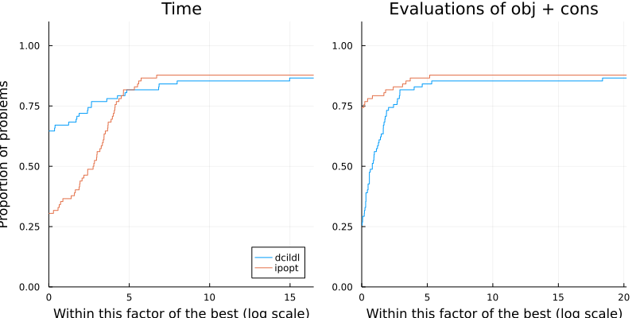

# Summary

`DCISolver.jl` is a new Julia implementation of the Dynamic Control of Infeasibility method (DCI), introduced by @bielschowsky2008dynamic, for solving the equality constrained nonlinear optimization problem
\begin{equation}\label{eq:nlp}
    \underset{x \in \mathbb{R}^n}{\text{minimize}} \quad f(x) \quad \text{subject to} \quad h(x) = 0,
\end{equation}
where  $f:\mathbb{R}^n \rightarrow \mathbb{R}$ and  $h:\mathbb{R}^n \rightarrow \mathbb{R}^m$ are twice continuously differentiable.
DCI is an iterative method that aims to compute a local minimum of \eqref{eq:nlp} using first and second-order derivatives.

Each DCI iteration is a two-step process: a tangential step first approximately minimizes a quadratic model subject to linearized constraints within a trust region and a normal step recenters feasibility by way of a trust cylinder, which is the set of points such that $\|h(x)\| \leq \rho$, where $\rho > 0$.
The idea of trust cylinders is to control infeasibility, contrary to penalty methods, which encourage feasibility by penalizing infeasibility.
Each time the trust cylinder is violated during the tangential step, the normal step brings infeasibility back within prescribed limits.
The radius $\rho$ of the trust cylinder decreases with the iterations, so a feasible and optimal point results in the limit.
For details and theoretical convergence, we refer the reader to the original paper [@bielschowsky2008dynamic].

`DCISolver.jl` is built upon the JuliaSmoothOptimizers (JSO) tools [@jso]. JSO is an academic organization containing a collection of Julia packages for nonlinear optimization software development, testing, and benchmarking. It provides tools for building models, accessing repositories of problems, and solving subproblems. `DCISolver.jl` takes as input an `AbstractNLPModel`, JSO's general model API defined in `NLPModels.jl` [@orban-siqueira-nlpmodels-2020], a flexible data type to evaluate objective and constraints, their derivatives, and to provide any information that a solver might request from a model. The user can hand-code derivatives, use automatic differentiation, or use JSO-interfaces to classical mathematical optimization modeling languages such as AMPL [@fourer2003ampl], CUTEst [@cutest] or JuMP [@jump]. Moreover, the API handles sparse matrices and operators for matrix-free implementations.

Internally, `DCISolver.jl` combines cutting-edge numerical linear algebra solvers. The normal step relies heavily on iterative methods for linear algebra from `Krylov.jl` [@montoison-orban-krylov-2020], which provides more than 25 implementations of standard and novel Krylov methods, and they all can be used with Nvidia GPU via CUDA.jl [@besard2018juliagpu].
The tangential step is computed using the sparse factorization of a symmetric and quasi-definie matrix via `LDLFactorizations.jl` [@orban-ldlfactorizations-2020], or the well-known Fortran code `MA57` [@duff-2004] from the @HSL, via `HSL.jl` [@orban-hsl-2021].

One of the significant advantages of our implementation is that the normal step is factorization free, i.e., it uses second-order information via Hessian-vector products but does not need access to the Hessian as an explicit matrix.
This makes `DCISolver.jl` a valuable asset for large-scale problems, for instance to solve PDE-constrained optimization problems [@migot-orban-siqueira-pdenlpmodels-2021] as illustrated in `PDEOptimizationProblems` [@pdeoptimizationproblems].

<!--
NOTE: Next paragraph is not really relevant here. Who cares what the return value is? What's the performance? Can I use DCI to solve a PDE problem? How?

Maybe say a word about performance here?
-->

# Statement of need

Julia has been designed to efficiently implement softwares and algorithms fundamental to the field of operations research, particularly in mathematical optimization [@lubin2015computing], and has become a natural choice for developing new solvers. `DCISolver.jl` is coded in pure Julia, hence it does not require external compiled dependencies and work with multiple input data types.

There already exist ways to solve \eqref{eq:nlp} in Julia.
If \eqref{eq:nlp} is amenable to being modeled in `JuMP` [@jump], the model may be passed to state-of-the-art solvers, implemented in low-level compiled languages, via wrappers thanks to Julia's native interoperability with such languages.
However, interfaces to low-level languages have limitations that pure Julia implementations do not have, including the ability to apply solvers with various arithmetic types.
`Optim.jl` [@mogensen2018optim] implements a pure Julia primal-dual interior-point method for problems with both equality and inequality constrained modeled after Artlelys Knitro [@byrd2006k] and Ipopt [@wachter2006implementation].

JSO offers both types of solution mechanisms with thin wrappers to Artelys Knitro via `NLPModelsKnitro.jl` [@orban-siqueira-nlpmodelsknitro-2020] and Ipopt via `NLPModelsIpopt.jl` [@orban-siqueira-nlpmodelsipopt-2020] that let users pass in an `AbstractNLPModel`, and `Percival.jl` [@percival-jl], a pure Julia implementation of an augmented Lagrangian method based on bound-constrained subproblems.
One main advantage of JSO-compliant solvers is the consistent API; the origin of the input problem is irrelevant.
Finally, to the best of our knowledge, there is no available maintained open-source implementation of DCI in existence. The original authors did not make their implementation public, and the other known implementation is `dcicpp` [@dcicpp], extending the original method to inequalities in the Ph.D. thesis by @siqueira2013controle, and it has had no updates in the last 5 years. Hence, we offer an interesting alternative to augmented Lagrangian and interior-point methods in the form of an evolving, research level yet stable and mature, solver.

All in all, with a few lines of codes, one can solve large-scale problems or benchmark `DCISolver.jl` against other JSO-compliant solvers using `SolverBenchmark.jl` [@orban-siqueira-solverbenchmark-2020].
We include below performance profiles of `DCISolver` versus `Ipopt` on CUTEst problems with up to 10 000 variables and 10 000 constraints illustrating that `DCISolver` is a fast and stable alternative to a state of the art solver. Last but not least, the documentation of this package includes benchmarks on classical test sets  showing that this implementation is very competitive.

<!--
NOTE: Putting the code is too long
```
using CUTEst, DCISolver, NLPModels, NLPModelsIpopt, Plots, SolverBenchmark

problems = readlines("list_problems.dat")
cutest_problems = (CUTEstModel(p) for p in problems)

solvers = Dict(
  :ipopt => nlp -> ipopt(
      nlp,
      print_level = 0,
      dual_inf_tol = Inf,
      constr_viol_tol = Inf,
      compl_inf_tol = Inf,
      acceptable_iter = 0,
      max_cpu_time = 1200.0,
      tol = 1e-5,
  ),
  :dcildl => nlp -> dci(
      nlp,
      linear_solver = :ldlfact,
      max_time = 1200.0,
      max_iter = typemax(Int64),
      max_eval = typemax(Int64),
      atol = 1e-5,
      ctol = 1e-5,
      rtol = 1e-5,
  ),
)
stats = bmark_solvers(solvers, cutest_problems)

solved(df) = (df.status .== :first_order)
costs = [
  df -> .!solved(df) * Inf + df.elapsed_time,
  df -> .!solved(df) * Inf + df.neval_obj + df.neval_cons,
]
costnames = ["Time", "Evalutions of obj + cons"]
p = profile_solvers(stats, costs, costnames)
```
-->



# Acknowledgements

Tangi Migot is supported by IVADO and the Canada First Research Excellence Fund / Apogée,
and Dominique Orban is partially supported by an NSERC Discovery Grant.

# References
